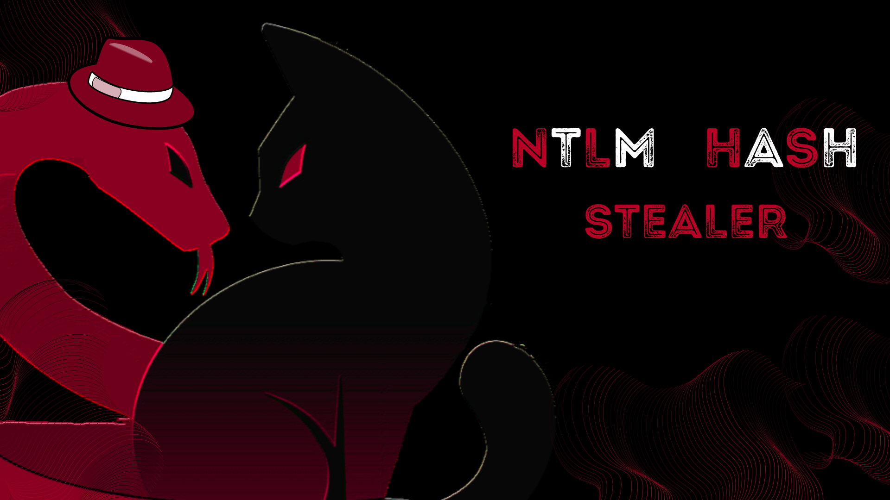
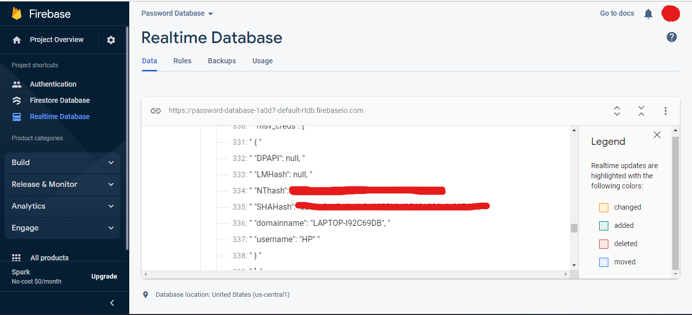

# 🩸 NTLM-Hash-Stealer
[](https://pypi.python.org/pypi/ansicolortags/)
[](https://www.python.org/)
[](https://shields.io/)



**Note:** This installs several files on your system (It's recommended to use a VM while testing). <br>
**Brief-description:** Steals NTLM Hash and other credentials and outputs it to firebase.

## ⚙ Requirements


## 🩸 Installation
```hs
PS C:\Users\HP\> $git clone https://github.com/FonderElite/NTLM-Hash-Stealer/

PS C:\Users\HP\> $pip3 install -r requirements.txt
```
## 🩸 Usage
```hs
PS C:\Users\HP\> $python3 main.py
```

## 🩸 Demo


## 🎉 Credits
<a href="https://github.com/skelsec/pypykatz"></a>


